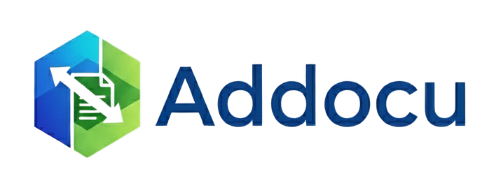

# Addocu 🚀

  <h3>🎯 Audit and Document Your Google Marketing Stack in Seconds</h3>
  
<em>A powerful, free and open-source Google Sheets™ Add-on for digital marketers, analysts, and agencies</em>

---

## ✨ What is Addocu?

Addocu automates the painful process of documenting and auditing your entire Google ecosystem, pulling detailed metadata from **GA4**, **GTM**, **Looker Studio**, **Google Ads**, **BigQuery**, **Merchant Center**, **Search Console**, **YouTube**, **AdSense**, and **G. Business Profile** directly into your spreadsheet.

**Born from countless hours** spent on manual documentation and a belief that there had to be a better way. We're sharing it with the community to give back and to build, together, the best auditing tool possible.

  

---

## 🎯 Why Choose Addocu?

<table>
<tr>
<td>

### 🆓 **Open Source & Self-Hostable**

- Full source code available on GitHub
- Deploy your own instance for free
- Modify and customize to your needs

</td>
<td>

### ⚡ **One-Click Auditing**

- Complete audit of 10 Google platforms in seconds
- No manual data collection or documentation
- Interactive dashboard with executive summary

</td>
</tr>
<tr>
<td>

### 🔒 **Privacy & Security First**

- Your data never leaves your Google account
- No external servers or data transmission
- Complete transparency with open source code

</td>
<td>

### 🤝 **Community Driven**

- Built by digital marketers, for digital marketers
- Actively maintained and improved
- Contributing makes you part of the journey

</td>
</tr>
</table>

---

## 📦 Two Ways to Use Addocu

| | **🔧 Self-Hosted (Free)** | **☁️ Marketplace Add-on (Paid)** |
|---|---|---|
| **Source** | Clone from GitHub | Install from Google Workspace Marketplace |
| **Cost** | Free forever | Subscription-based |
| **Setup** | Manual deployment via `clasp` | One-click install |
| **Updates** | Pull from GitHub manually | Automatic updates |
| **Support** | Community (GitHub Issues/Discussions) | Priority support included |
| **Best For** | Developers, self-hosters, contributors | Agencies, teams, non-technical users |

> [!TIP]
> **Not sure which to choose?** If you're comfortable with Google Apps Script and `clasp`, go self-hosted. If you want convenience and support, get the Marketplace add-on.

## ✨ Key Features

### 📊 **Google Analytics 4 Complete Audit**

- **Properties & Data Streams:** Full inventory with detailed configuration
- **Custom Dimensions & Metrics:** Complete listing with scope and parameter names
- **Conversion Events:** All events with configuration details and status
- **Audiences:** User segments with creation dates and criteria
- **Data Retention Settings:** Current policies and privacy configurations

### 🏷️ **Google Tag Manager Deep Dive**

- **Container Inventory:** All containers with publication status and version history
- **Tags, Triggers & Variables:** Complete mapping of your GTM setup with firing status
- **Version Comparison:** Compare different container versions side-by-side
- **Workspace Analysis:** Multi-workspace support for complex organizational setups
- **Dependency Mapping:** Understand relationships between tags, triggers, and variables

### 📈 **Looker Studio Census**

- **Report Inventory:** All reports with owners, sharing settings, and modification dates
- **Data Sources:** Complete mapping of connections and refresh status
- **Performance Metrics:** Usage statistics and data freshness indicators
- **Permissions Audit:** Who has access to what reports across your organization

### 💰 **Google Ads Comprehensive Audit**

- **Campaigns:** Status, type, startDate, and endDate for all campaigns
- **Conversion Actions:** Detailed inventory of tracking events and categories
- **Audiences:** User lists and remarketing segments with size estimates

### 🏪 **Google Business Profile (GBP)**

- **Accounts:** Inventory of all business accounts/groups managed
- **Locations:** Complete list of physical storefronts and verification status

### 🛍️ **Merchant Center & Shopping**

- **Feeds:** Data source health and configurations
- **Products:** Sampling and health of your merchant products

### 🗄️ **BigQuery (Cloud Data)**

- **Datasets:** Enterprise data storage inventory
- **GA4 Backups:** Monitoring the health of real-time exports

### 📰 **AdSense (Publishing)**

- **Monetization:** Audit of ad units, sites, and channels

### 🎯 **Interactive Dashboard**

- **Visual Summary:** Bird's eye view of your entire marketing stack health
- **Connectivity Diagnostics:** Real-time API connection and permission testing
- **Asset Overview:** Count and status of all your marketing assets
- **Quick Actions:** Direct links to manage properties and troubleshoot issues

### 🔧 **Advanced Features**

- **Comprehensive Logging:** Every action logged for debugging and audit trails
- **Multi-Account Support:** Switch between different Google accounts seamlessly
- **Export Ready:** All data formatted for easy sharing and client reporting
- **Error Recovery:** Built-in troubleshooting and permission recovery tools

---

## 🚀 Quick Start

### **⬇️ Install from Google Workspace Marketplace**

### **Step-by-Step Setup:**

1. **📥 Install Addocu** from the [Google Workspace Marketplace](https://workspace.google.com/marketplace)
2. **📝 Open Google Sheets** (new or existing spreadsheet)
3. **⚙️ Open the Add-on** → `Extensions > Addocu > Configure`
4. **🔑 Authorize Permissions** when prompted. That's it! The connection is automatic via OAuth2.
5. **🚀 Run Audit** → `Extensions > Addocu > Audit Complete Stack`

**That's it!** Your audit data will appear in dedicated sheets:

- `DASHBOARD` - Executive summary
- `GA4_PROPERTIES` - Analytics data
- `GTM_TAGS` - Tag Manager inventory
- `LOOKER_STUDIO` - Report catalog
- `GOOGLE_ADS_CAMPAIGNS` - Paid media campaigns
- `GBP_LOCATIONS` - Business locations
- `GMC_PRODUCTS` - Merchant Center sample
- `BQ_DATASETS` - BigQuery inventory
- `ADSENSE_SITES` - AdSense properties
- `LOGS` - Detailed operation logs

## 📋 Prerequisites

### 🚨 **CRITICAL: Same Google Account Requirement**

⚠️ **You MUST be logged into Google Chrome AND Google Sheets with the SAME Google account.** Different accounts cause permission errors.

<strong>🔧 Click here if you're having issues</strong>

**Before anything else:**

1. Check your Chrome profile (top-right corner)
2. Check your Google Sheets account (top-right corner)
3. If different → Sign out everywhere and use ONE account

**95% of Addocu issues are caused by account mismatches!**

**Quick Fix:**

1. `Extensions > Addocu > Troubleshooting > Reauthorize Permissions`
2. Authorize ALL permissions when prompted

📖 **Full Troubleshooting Guide:** [docs/troubleshooting.md](docs/troubleshooting.md)

### 🔑 **Access Requirements**

- **"Viewer"** (or higher) access to the Google platforms you wish to audit
- **OAuth2 Authentication:** Handled automatically. **No manual API key setup is required.**

---

## 🗂️ Technical Architecture

<strong>📁 Project Structure</strong>

📁 Addocu Open Source Project
├── 📄 appsscript.json           # Add-on manifest and permissions
├── 📄 coordinator.js            # UI orchestration and menu logic
├── 📄 utilities.js              # Authentication and API utilities
├── 📄 ga4.js                    # GA4 data extraction engine
├── 📄 gtm.js                    # GTM synchronization logic
├── 📄 looker_studio.js          # Looker Studio API integration
├── 📄 logging.js                # Comprehensive logging system
├── 📄 dashboard.js              # Dashboard generation logic
├── 📄 configuration.html        # Configuration sidebar UI
├── 📄 interactive_dashboard.html # Interactive dashboard interface
├── 📁 docs/                     # Documentation and guides
├── 📁 examples/                 # Usage examples and samples
└── 📁 .github/                  # GitHub templates and workflows

### **🛡️ Security & Privacy**

- **Complete Data Isolation:** Each user's data stored separately using `PropertiesService.getUserProperties()`
- **No External Servers:** Everything runs within Google's secure infrastructure
- **Read-Only Access:** Addocu never modifies your GA4, GTM, or Looker Studio configurations
- **OAuth 2.0 Compliance:** Secure authentication following Google's best practices
- **Full Transparency:** Open source code available for security auditing

---

## 📄 License & Usage

**Addocu is distributed under the [Creative Commons Attribution-NonCommercial-ShareAlike 4.0 International License](LICENSE)**

### **✅ You ARE free to:**

- ✨ Use the tool for personal or client projects
- 🔄 Share and distribute the tool
- 🔧 Modify and adapt the code for your needs
- 🏢 Use it in your agency or consultancy work

### **⚠️ With these conditions:**

- **📝 Attribution:** Always credit the original project
- **🚫 Non-Commercial:** You cannot sell this tool or charge for it
- **🔄 Share-Alike:** Any modifications must be shared under the same license

## 🗺️ Roadmap & Future

### **📍 Current Status: v2.3.0 (Full Stack Edition)**

- ✅ Complete integration of 10 Google Marketing platforms
- ✅ GA4, GTM, Looker Studio, Ads, GSC, YT, GBP, GMC, BQ, AdSense
- ✅ **Zero-Data Handling**: Smart detection and reporting for empty platforms
- ✅ Interactive dashboard with real-time connectivity diagnostics
- ✅ Open source codebase with community-driven license
- ✅ Automatic OAuth2 authentication across all services

### **🔮 Planned Features**

- 📋 **DV360 & SA360** integration
- 📋 AI-driven error detection and optimization recommendations
- 📋 Multi-language support (ES, FR, PT, IT)
- 📋 Automated scheduling and historical monitoring

### **� A Note on Our Distribution Model**

Addocu follows an **Open Core** model:

| **GitHub (This Repository)** | **Google Workspace Marketplace** |
|---|---|
| 🆓 Free forever | 💳 Paid subscription |
| Clone, deploy, modify | One-click install |
| Community support | Priority support |
| Self-managed updates | Auto-updates |

The source code here will **always remain open-source** under CC BY-NC-SA 4.0. The Marketplace add-on provides a convenient, supported experience for those who prefer it.

---

## 🤝 Contributing

**We welcome contributions from the community!**

### **🌟 Ways to Contribute:**

| 🐛 **Report Issues** | 💡 **Suggest Features** | 🔧 **Contribute Code** | 📖 **Improve Docs** |
|:---:|:---:|:---:|:---:|
| Found a bug? [Open an issue](https://github.com/Addocu/addocu/issues) | Have an idea? [Start a discussion](https://github.com/Addocu/addocu/discussions) | Fork → Code → PR | Fix typos, add examples |

### **🚀 Getting Started:**

1. **Fork** the repository
2. **Create** a feature branch (`git checkout -b feature/amazing-feature`)
3. **Commit** your changes (`git commit -m 'Add amazing feature'`)
4. **Push** to the branch (`git push origin feature/amazing-feature`)
5. **Open** a Pull Request

**📖 Read our [Contributing Guide](CONTRIBUTING.md) for detailed instructions**

> [!TIP]
> **Developer Note**: This project uses `clasp` for local development.
> Run `clasp push` to sync your local changes to the Google Apps Script project.

---

## 🆘 Support & Community

| 💬 **Discussions** | 🐛 **Bug Reports** | 📧 **Direct Support** | 🌐 **Website** |
|:---:|:---:|:---:|:---:|
| [GitHub Discussions](https://github.com/Addocu/addocu/discussions) | [GitHub Issues](https://github.com/Addocu/addocu/issues) | <hello@addocu.com> | [addocu.com](https://addocu.com) |

### **📚 Documentation:**

- 📖 [Installation Guide](docs/installation.md)
- ⚙️ [Configuration Help](docs/configuration.md)
- 🔧 [Troubleshooting Guide](docs/troubleshooting.md)

### **📱 Stay Updated:**

- 🌐 **Website:** [addocu.com](https://addocu.com)
- 📱 **LinkedIn:** Follow our [building in public journey](https://www.linkedin.com/company/addocu)
- 📊 **Use Cases:** Real-world examples and success stories

---

## 🏆 Contributors

**Thank you to all the amazing people who have contributed to Addocu!**

**Made with [contrib.rocks](https://contrib.rocks)**

---

## 🙏 Acknowledgments

- **Google Workspace Team** for the excellent Add-on platform
- **Digital Marketing Community** for inspiration and feedback
- **Open Source Contributors** who help make this tool better every day
- **Beta Testers** who provided invaluable early feedback
- **You!** For considering Addocu for your marketing auditing needs

---

## 📈 Project Stats

---

**Made with ❤️ for the digital marketing community**

*Addocu is not affiliated with Google LLC. Google Analytics, Google Tag Manager, Looker Studio, and Google Workspace are trademarks of Google LLC.*

**⭐ If Addocu helps you, please give us a star on GitHub! ⭐**

